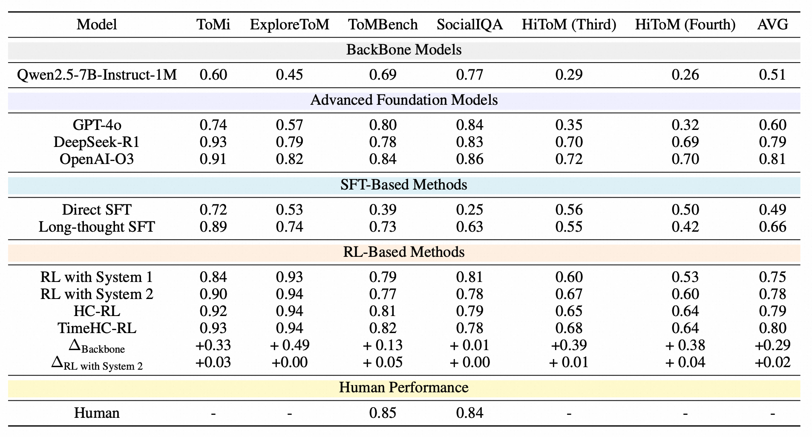

  <h1> TimeHC-RL: Temporal-aware Hierarchical  
Cognitive Reinforcement Learning for Enhancing  
LLMs’ Social Intelligence</h1>

<section class="hero">
    

      

        

          

            

                

                    

                    🔗 <a href="https://arxiv.org/abs/2505.24500" target="_blank">arXiv</a> |
                    📄 <a href="https://arxiv.org/pdf/2505.24500" target="_blank">PDF</a> 
                    

                

                

              

                
                  <a href="mailto:gyhou@zju.edu.cn" target="_blank">Guiyang Hou</a>1*,
                
                
                  Xing Gao2,
                
                
                  Yuchuan Wu2,
                
                
                  Xiang Huang2,3,
                
                
                  Wenqi Zhang1,
                
                
                  Zhe Zheng1,
                
                
                  Yongliang Shen1,
                
                
                  Jialu Du1,
                
                
                  Fei Huang2,
                
                
                  <a href="mailto:shuide.lyb@alibaba-inc.com" target="_blank">Yongbin Li</a>2†,
                
                
                  <a href="mailto:luwm@zju.edu.cn" target="_blank">Weiming Lu</a>1†,
                
              

                  

                    1Zhejiang University,
                    2Tongyi Lab, Alibaba Group,
                    3Nanjing University
                     
                    Preprint. Under review.
                    <small> *This work was done when the first author was an intern at Tongyi Lab, †Corresponding Author</small>
                  

  
</section>

#### Results

## Contact Us
If you have any questions, please contact us by email: 
gyhou@zju.edu.cn, luwm@zju.edu.cn
